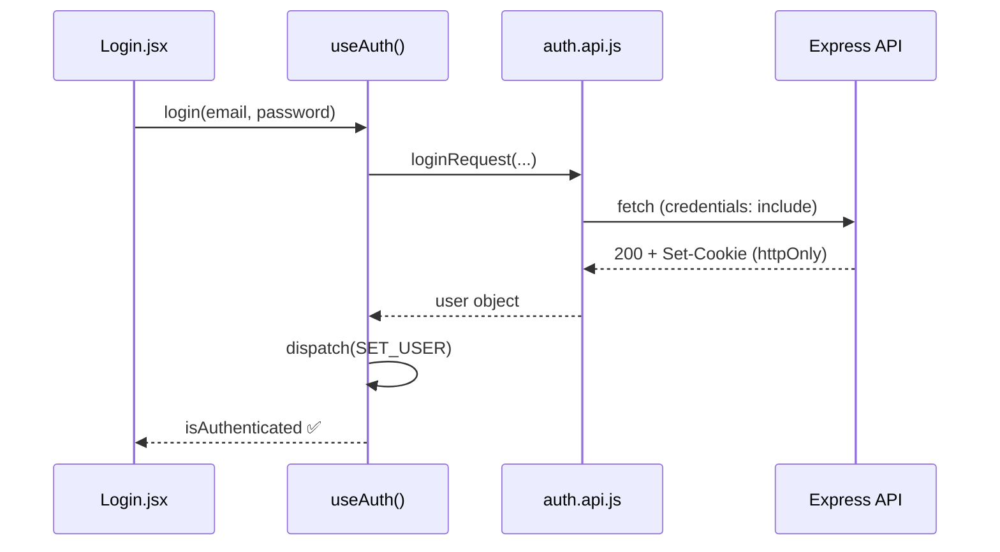
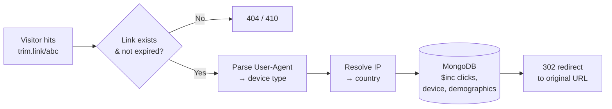
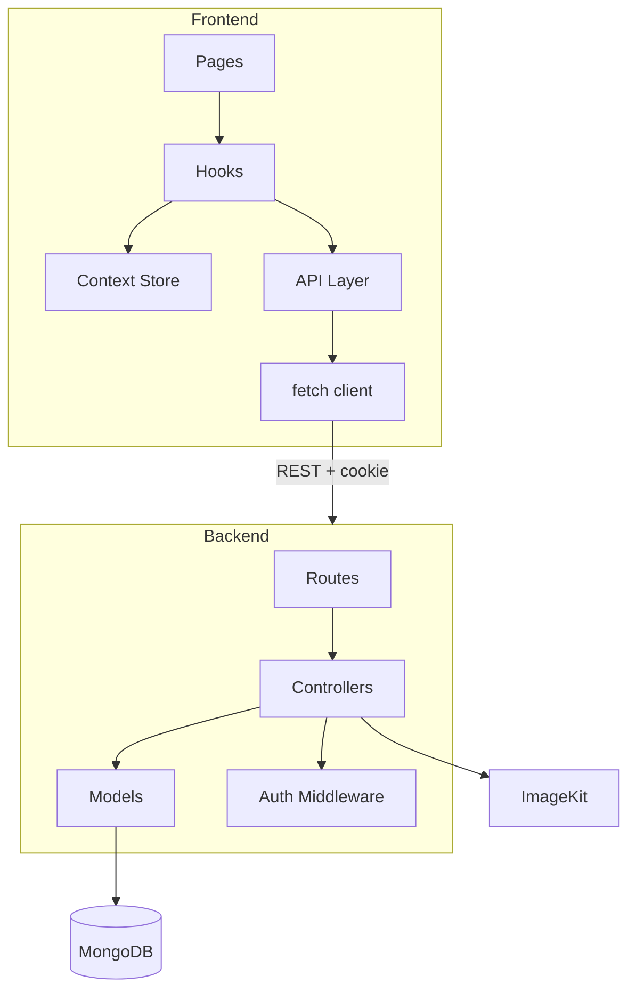

<div align="center">

#  TrimLink

**A URL shortener that actually shortens URLs — plus auth, QR codes, and per-link analytics.**


</div>

---


| | |
|---|---|
| 🔐 Auth | JWT in an `httpOnly` cookie — invisible to JS, so an XSS bug can't steal it |
| 📊 Analytics | Every redirect logs device type + country, no client-side tracking script |
| 🧱 Frontend | 4-layer architecture: `UI → hooks → api → network` — pages never call `fetch` |
| 📦 QR codes | Auto-generated per link, hosted on ImageKit |
| 🌍 Geolocation | Offline IP→country lookup — zero added latency per redirect |

---

##  Request flow



##  Click tracking flow



##  Architecture



---

##  Stack

| Layer | Tech |
|---|---|
| Frontend | React 18, Vite, React Router v6, SCSS |
| Backend | Node.js, Express, Mongoose |
| Auth | JWT, `httpOnly` cookies |
| QR | `qrcode` → ImageKit |
| Geo | `geoip-lite` (offline) |
| Export | `jsPDF`, `html2canvas` |

---

##  API


| Method | Route | 🔒 | Description |
|---|---|:---:|---|
| POST | `/api/auth/register` | | Create account |
| POST | `/api/auth/login` | | Log in |
| POST | `/api/auth/logout` | | Log out |
| GET | `/api/auth/me` | 🔒 | Restore session on refresh |
| GET | `/api/links` | 🔒 | List your links |
| POST | `/api/links` | 🔒 | Create link + QR |
| DELETE | `/api/links/:id` | 🔒 | Delete a link |
| GET | `/api/analytic/:id` | 🔒 | Click/device/country stats |
| GET | `/:trim_link` | | Public redirect + click tracking |


---

##  Run it

```bash
# backend
cd trimlink-backend && npm install
cp .env.example .env   # MONGO_URI, JWT_SECRET, IMAGEKIT_*
npm run dev             # :3000

# frontend
cd trimlink-frontend && npm install
cp .env.example .env
npm run dev             # :5173
```

---

##  Ask me about

- Why a cookie instead of `localStorage` for the JWT
- Why device/country tracking needs zero client-side script
- What I'd swap `useLinks`/`useAnalytics` for at scale (→ TanStack Query)

<div align="center">

Built solo · feedback welcome

</div>
